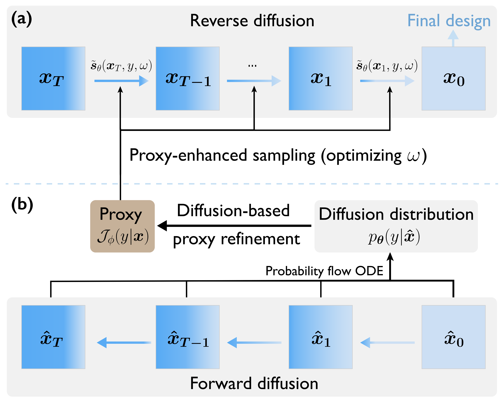

## Project Description

Offline black-box optimization aims to maximize a black-box function using an offline dataset of designs and their measured properties. Our project propose **R**obust **G**uided **D**iffusion (*RGD*) for Offline Black-box Optimization, melding the advantages of proxy and proxy-free diffusion for robust guided diffusion. 

<p align="center">
  
</p>


RGD is comprised of two key modules:
1. **Proxy-enhanced Sampling**: utilizes the explicit guidance from a trained proxy to bolster the proxy-free diffusion with a stronger control.
2. **Diffusion-based Proxy Refinement**: integrate insights from the proxy-free diffusion back into the proxy.


## Installation

The project relies on several essential libraries, including PyTorch and Design-Bench. Install the required dependencies with:

```bash
pip install -r requirements.txt
```

## Reproducing Performance

To replicate our method's performance for specific tasks, follow these steps:

For the AntMorphology-Exact-v0 task:

- Train a proxy:
  ```bash
  python main.py --task AntMorphology-Exact-v0 --mode classifier_training --epochs 200
  ```

- Train a proxy-free diffusion model:
  ```bash
  python main.py --task AntMorphology-Exact-v0 --mode diffusion_training_elbo --epochs 1000
  ```

- Fine-tune the classifier with *diffusion-based proxy refinement*:
  ```bash
  python main.py --task AntMorphology-Exact-v0 --mode classifier_finetuning
  ```

- Run *proxy-enhanced sampling*:
  ```bash
  python main.py --task AntMorphology-Exact-v0 --mode both
  ```

The same steps apply to the discrete task TFBind10-Exact-v0:

```bash
python main.py --task TFBind10-Exact-v0 --mode [MODE] --epochs [EPOCHS]
```
Replace `[MODE]` with the desired mode and `[EPOCHS]` with the number of training epochs.

## Hyperparameter Sensitivity 

Evaluate the impact of various hyperparameters such as the number of diffusion steps $T$, the condition label $y$, and the sample learning rate $\eta$ on the model's performance.

- For different $T$ values (500, 750, 1000, 1250, 1500):
  ```bash
  T_values=(500 750 1000 1250 1500)
  for T in ${T_values[*]};
  do
      python main.py --task AntMorphology-Exact-v0 --num_steps $T
  done
  ```

- For different $y$ values (0.5, 1.0, 1.5, 2.0, 2.5):
  ```bash
  y_values=(0.5 1.0 1.5 2.0 2.5)
  for y in ${y_values[*]};
  do
      python main.py --task AntMorphology-Exact-v0 --y_ratio $y
  done
  ```

- For different sample learning rate $\eta$ [2.5e-3, 5.0e-3, 1.0e-2, 2.0e-2, 4.0e-2]:
  ```bash
  sample_lrs=(2.5e-3 5.0e-3 1.0e-2 2.0e-2 4.0e-2)
  for sample_lr in ${sample_lrs[*]};
  do
      python main.py --task AntMorphology-Exact-v0 --sample_lr $sample_lr
  done
  ```

## Acknowledgements

We extend our gratitude to the following resources for their invaluable contributions to our project:
1. [Design-Bench Library](https://github.com/brandontrabucco/design-bench)
2. [Score-based SDE Repository](https://github.com/yang-song/score_sde_pytorch)
3. [DDOM](https://github.com/siddarthk97/ddom)
4. [Parallel Mentoring](https://github.com/GGchen1997/parallel_mentoring)
